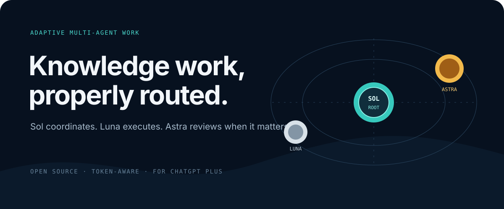
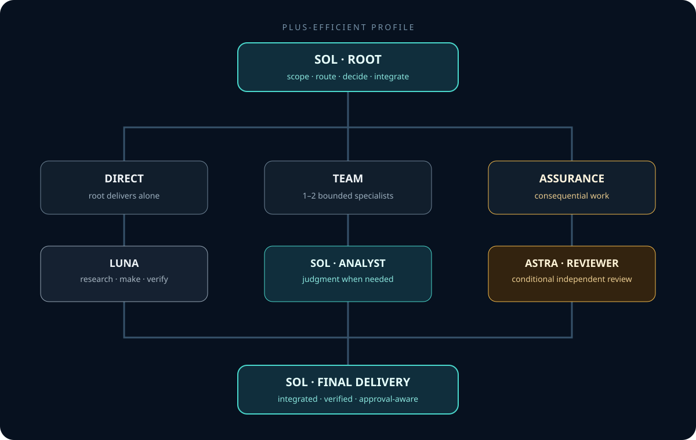

<div align="center">
  
</div>

<p align="center">
  <strong>A token-aware multi-agent operating system for knowledge work in Codex.</strong>
</p>

<p align="center">
  <a href="https://github.com/lell13/codex-knowledge-work-orchestrator/actions/workflows/validate.yml"></a>
  <a href="LICENSE"></a>
  <a href="https://learn.chatgpt.com/docs/pricing"></a>
</p>

Most Codex orchestration examples are designed around software development. This project adapts multi-agent orchestration to research, analysis, documents, spreadsheets, presentations, content, and business operations.

It was created for people like its author: professionals who want to use Codex seriously, but struggle with usage limits, long contexts, and expensive models being applied to work that does not need them.

The default strategy is deliberately economical:

> **Start direct with Sol. Delegate bounded work to Luna. Use Astra only when the decision needs it.**

## Why this exists

Using the strongest model for every step feels safe, but it can exhaust a Plus allowance quickly. Spawning a full team for every request has the same problem. Every agent adds context, latency, and usage.

This project offers a practical middle ground: reserve expensive judgment for the moments that need it and use lighter models for focused execution. The orchestrator chooses the smallest team that can materially improve the result.

- **Sol** keeps the goal, makes routing decisions, and integrates the final deliverable.
- **Luna** handles focused research, production, extraction, and verification.
- **Astra** enters only when ambiguity, consequence, or independent review earns the additional usage.
- **The user** keeps final authority over publication, external communication, spending, permissions, and irreversible actions.

This approach is designed to reduce avoidable usage; it cannot guarantee a fixed token saving or a specific number of additional messages. Task size, context, tools, model behavior, and product limits all affect actual usage.

## Who this is for

- Professionals and creators using Codex for work beyond software development.
- ChatGPT Plus users who need their usage allowance to last longer.
- People who want multi-agent quality without managing a permanent swarm.
- Non-coders who prefer a ready-to-use operating method over building an agent system from scratch.

## How it protects your usage

| Principle | What the orchestrator does |
| --- | --- |
| Start small | Uses Direct mode unless delegation has a concrete benefit |
| Match model to work | Routes routine execution to Luna and everyday judgment to Sol |
| Escalate on evidence | Uses Astra only for difficult synthesis, material consequence, or useful independent review |
| Keep context lean | Gives each specialist only the files and instructions required for its assignment |
| Stop when done | Avoids repeated research, reviews, and tests after the acceptance criteria pass |

## How it works

<div align="center">
  
</div>

The root classifies every request before delegating:

| Mode | Team | Use it when |
| --- | --- | --- |
| **Direct** | Root only | The task is small, clear, and locally verifiable. |
| **Team** | Root + 1–2 specialists | Independent workstreams can save time or improve evidence. |
| **Assurance** | Root + specialists + reviewer | The output is consequential, public, financial, or difficult to reverse. |

## Recommended profile for ChatGPT Plus

`plus-efficient` is the default:

| Role | Model | Reasoning | Purpose |
| --- | --- | --- | --- |
| Root | GPT-6 Sol | medium | Scope, route, decide, integrate |
| Researcher | GPT-6 Luna | medium | Find and extract evidence |
| Maker | GPT-6 Luna | medium | Produce bounded artifacts |
| Verifier | GPT-6 Luna | low | Check requirements and consistency |
| Analyst | GPT-6 Sol | medium | Handle judgment-heavy analysis when a separate pass helps |
| Reviewer | GPT-6 Astra | medium | Review material risk independently when needed |

Astra review is conditional. The orchestrator does not spawn every role mechanically. A root-only run is often the most efficient path.

## Install

### Easiest: ask Codex to install it

Open the project where you want to use the orchestrator and paste:

```text
Install the plus-efficient profile from
https://github.com/lell13/codex-knowledge-work-orchestrator
in this project. Preserve existing .codex and .agents files, show me any
conflicts, and do not overwrite them without my approval.
```

Restart Codex in that project after installation.

### Manual installation

Clone the repository and run the installer from its root.

### macOS or Linux

```bash
./setup.sh /path/to/your/project plus-efficient
```

### Windows PowerShell

```powershell
.\setup.ps1 -TargetPath C:\path\to\your\project -Profile plus-efficient
```

The installer adds project-scoped Codex configuration and the `knowledge-work-orchestrator` skill. Existing files are preserved unless you explicitly use the force option; forced replacements receive timestamped backups.

Available profiles:

- `plus-efficient`: Sol root, Luna specialists, conditional Astra review. Recommended.
- `plus-economy`: Luna root and specialists, conditional Sol analysis/review.
- `plus-quality`: Astra root, Luna/Sol specialists, conditional Sol review.

Read [Choosing a profile](docs/choosing-a-profile.md) for the trade-offs.
For the rationale behind each assignment, see [Model selection](docs/model-selection.md).
For the complete usage policy, see [Usage efficiency](docs/usage-efficiency.md).

## Use

Codex can select the skill automatically for substantial knowledge-work tasks. You can also invoke it explicitly:

```text
$knowledge-work-orchestrator

Research the Brazilian market for AI training for small businesses.
Return an evidence-backed decision memo and clearly separate facts,
inferences, and open questions.
```

Other examples:

```text
Use $knowledge-work-orchestrator to compare these three proposals and
prepare a one-page executive recommendation.
```

```text
Use $knowledge-work-orchestrator to inspect this workbook, verify the
formulas, and produce an executive summary of the findings.
```

See complete examples for an [executive decision](examples/executive-decision.md), [market research](examples/market-research.md), and [spreadsheet analysis](examples/spreadsheet-analysis.md).

## Built-in safeguards

- Delegation must have a concrete benefit.
- Parallel work is limited to independent workstreams.
- Every subagent receives a bounded contract and only the context it needs.
- Research distinguishes evidence from inference.
- Verification is specific to the artifact type.
- External and irreversible actions remain approval-gated.
- Final integration always belongs to the root.

See [How it works](docs/how-it-works.md) and [Permissions](docs/permissions.md).

## Validate

The validator uses only the Python standard library:

```bash
python scripts/validate.py
```

It checks profile TOML, agent contracts, skill metadata, required community files, local links, and unfinished placeholders.

## Project status

This is an experimental `v0.1.0`. The architecture is grounded in current Codex model roles, but the efficiency claims are hypotheses until repeated benchmarks are published. See [Benchmarking](docs/benchmarking.md).

## Inspiration

Inspired by [donvito/codex-astra-luna-orchestrator](https://github.com/donvito/codex-astra-luna-orchestrator), which demonstrated a practical Astra-root and Luna-subagent topology for coding work. This project is an independent knowledge-work adaptation with its own routing policy, roles, profiles, documentation, and implementation.

## Contributing

Issues, examples, benchmark results, and pull requests are welcome. Start with [CONTRIBUTING.md](CONTRIBUTING.md).

## License

Licensed under the [Apache License 2.0](LICENSE).

